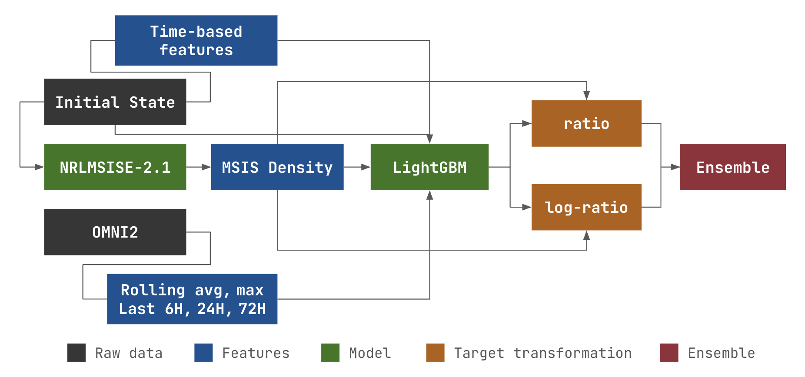

<div align=center>

# BiMA: Bias-Corrected LightGBM Model for Atmospheric Density Forecasting

Bias-Corrected Atmospheric Density Forecasting Using NRLMSIS 2.1 and LightGBM for the **MIT ARCLab Prize for AI Innovation in Space 2025 Challenge**

<p align="center">
<a href="#setup">Setup</a> &nbsp;&bull;&nbsp;
<a href="#usage">Usage</a> &nbsp;&bull;&nbsp;
<a href="#examples">Examples</a> &nbsp;&bull;&nbsp;
<a href="reports/model_report.pdf">Model Report</a> &nbsp;&bull;&nbsp;
<a href="https://www.codabench.org/competitions/5547">Challenge Page</a> &nbsp;&bull;&nbsp;
<a href="https://2025-ai-challenge.readthedocs.io/en/latest/dataset.html">Dataset</a> &nbsp;&bull;&nbsp;
<a href="https://arclab-mit.github.io/">Leaderboard</a>
</p>

[]()
[]()

<p align="center">
  
</p>

<div align="left">

## Project structure

```
├── configs/                    # Model experiment config
├── data
│   ├── interim/                # Intermediate processed data
│   └── raw/                    # Raw data of the challenge
├── models/                     # Final model training directory
├── reports                     # Model reports and images
│   ├── images/
│   └── model_report.pdf
├── runs/                       # Cross-validated model artefacts and log
├── src                         # Main source code
│   ├── config.py 
│   ├── dataset.py  
│   ├── eval.py           
│   ├── features.py         
│   ├── models.py
│   ├── qa.py
│   ├── utils.py
│   └── viz.py
├── model_performance.ipynb
├── submission.py
├── train.py
├── train.sh
└── validate.sh
```

## Setup

```
conda create -n orb python=3.10
conda activate orb
pip install -r requirements.txt
```

## Usage

Model training was executed in Windows/WSL environment

### Training

1. Download STORM-AI Phase 1 Public Training Dataset and locate under `data/raw` with this structure:

    ```
    └── data
        └── raw
            ├── meta
            │   ├── 00000_to_02284-initial_states.csv
            │   └── ...
            ├── omni2
            │   ├── omni2-00000-20000603_to_20000802.csv
            │   └── ...
            └── sat_density
                ├── champ_-00000-20000802_to_20000805.csv
                └── ...
    ```

2. Generate combined training dataset (saved into `data/interim`)

    ```
    python -m src.dataset
    ```

3. [OPTIONAL] Validate the models using grouped satellite-CV (artefacts and log will be saved into `runs/lag3det_final`)

    ```
    # validate.sh
    python train.py -c raw_ratio -dm lag3det_final --save_prediction --validate_future --train_mode validate
    python train.py -c raw_ratio_log -dm lag3det_final --save_prediction --validate_future --train_mode validate
    ```

4. Train the models using all data (final models will be saved into `models/lag3det_final`)

    ```
    # train.sh
    python train.py -c raw_ratio -dm lag3det_final --train_mode full_train
    python train.py -c raw_ratio_log -dm lag3det_final --train_mode full_train
    ```

### Inference

Inference for public and private test data was executed in Codabench platform ([tutorial](https://2025-ai-challenge.readthedocs.io/en/latest/submission.html)).

Running this command below locally will execute the code in DEBUG mode (check if .gitignore exist or not)

```
python submission.py
```

## Examples

Example of Model Forecasts for CHAMP satellite during 2003 Halloween Solar Storms, plot was generated from `model_performance.ipynb`

<p align="center">
  
</p>
